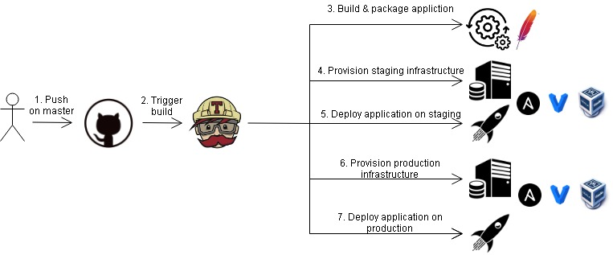

# Click Count application

## CI/CD Pipeline

The CI/CD pipeline (illustrated below) provision staging and production infrastructures. 
as well as it builds and deploys a java app inside them, using Travis CI, 
Ansible, Vagrant and VirtualBox.

